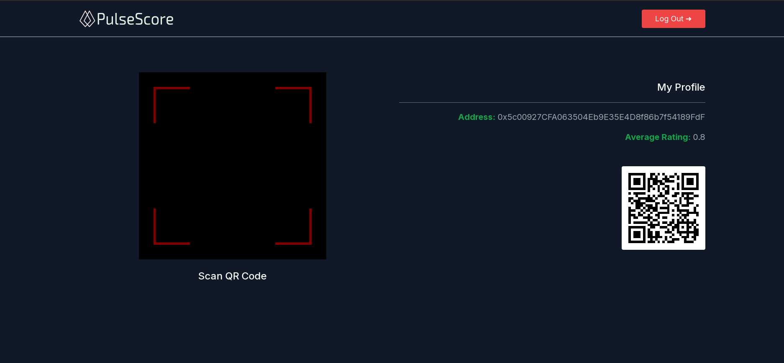
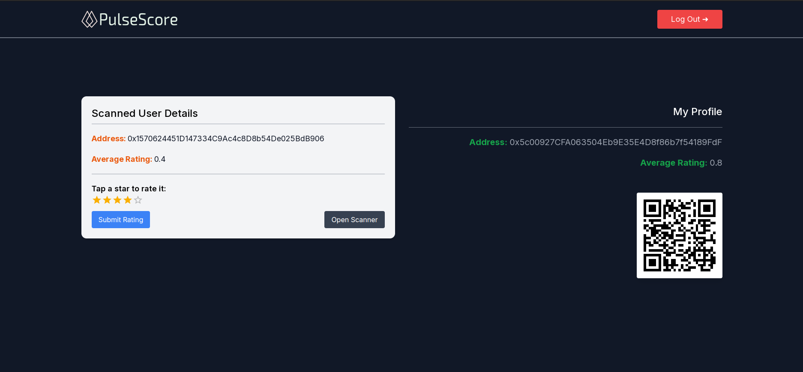

# PulseScore

PulseScore, a decentralized rating app, where users can rate each other, creating a blockchain-based reputation system with real-world social consequences.

## Tools & Technologies

- Solidity
- Remix
- Polygon
- Next.js
- TypeScript
- Tailwind CSS

## Contract Address

- [Amoy Scan](https://amoy.polygonscan.com/address/0x3DbDd3A45D68C0C60FdA2f4eb79809409ED15388)

- `0x3DbDd3A45D68C0C60FdA2f4eb79809409ED15388`

## Features

1. **View User Rating:** Displays the authenticated user's average rating.

2. **QR Code Scanner:** Allows users to scan QR codes to interact with other users' profiles.

3. **Rate Other Users:** After scanning a QR code, users can view the scanned user's rating and submit their own rating.

4. **Real-time Updates:** The application interacts with the Ethereum smart contract to fetch and update rating data.

---------

### [Live Demo](https://pulse-score.vercel.app/) on Vercel

---------

## 📷 Screenshot

  

  

## Contributing

Feel free to fork the repository and submit pull requests. For major changes, please open an issue to discuss the changes before submitting a pull request.